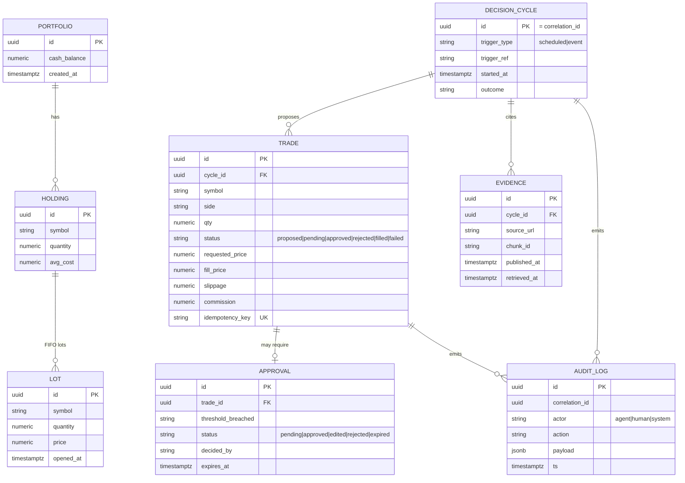
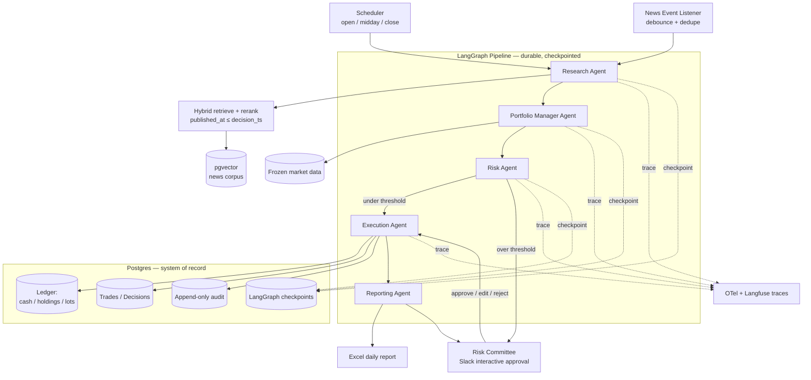
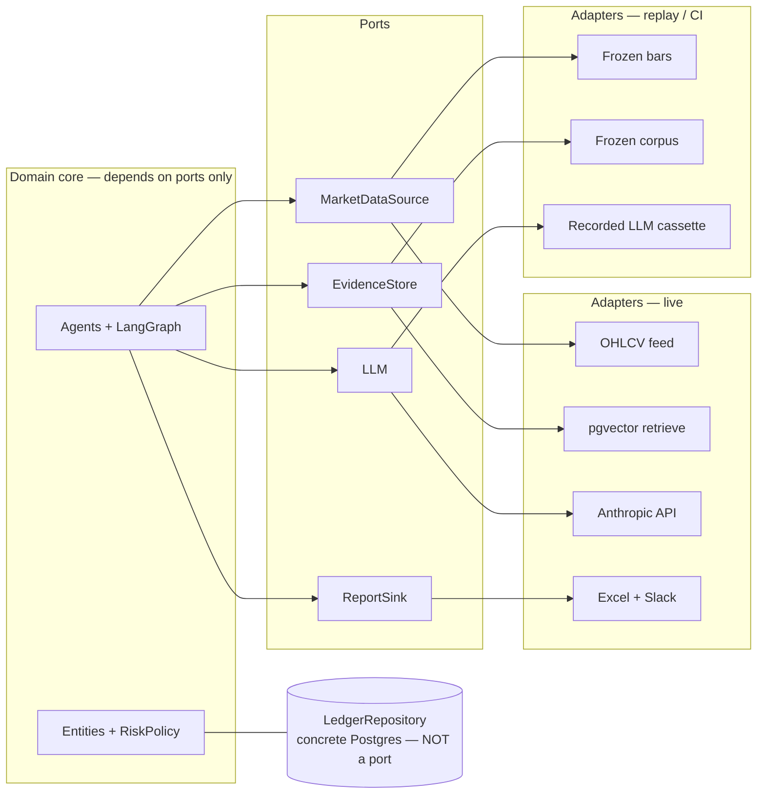
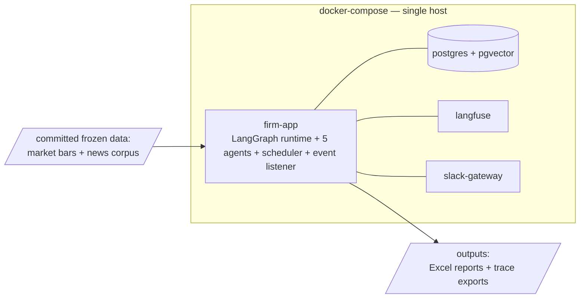

# The AI Investment Firm — Architecture Design

> Scope locked: **local Docker** runtime (self-hosted LangGraph; Terraform written as a deployment-view artifact, not applied) · **hybrid cadence** (scheduled checkpoints + news-event triggers) · **small watchlist** (~5–10 tickers).

---

## Problem

A multi-agent system that runs a paper-trading US-equities desk: agents research, decide, size, and execute trades with realistic fills; large trades pause for human approval; every decision is grounded in cited evidence, persisted transactionally, and replayable from a trace.

**The graded subject is production engineering, not trading alpha.** The architecture optimizes for correctness, durability, and auditability — not throughput, which at this scale is a non-issue.

**Strategy (v1, deliberately simple):** per symbol, the PM combines N-day momentum (market-data tools) with aggregate news sentiment (RAG) into a signal → enter/add above the buy threshold, trim/exit below the exit threshold, else hold; sizing is a target % of NAV hard-capped by `RiskPolicy`. Numbers never come from the LLM; thresholds live in config.

---

## Functional Requirements

| ID | Capability | Testable as |
|---|---|---|
| FR-1 | Manage a paper portfolio with realistic fills (slippage, commission, market-hours gating), persistent across restarts | Restart mid-run → cash/holdings/cost-basis intact |
| FR-2 | Run decision cycles on schedule (open/midday/close) **and** on qualifying news events | Inject a news event → a cycle fires |
| FR-3 | Multi-agent pipeline with typed contracts (Research→PM→Risk→Execution→Reporting) | Each agent has a Pydantic I/O schema + defined failure mode |
| FR-4 | Ground decisions in RAG evidence with citations; refuse/escalate when evidence insufficient | Empty corpus → refusal, not fabrication |
| FR-5 | Route trades over configurable thresholds to a human Risk Committee (approve/edit/reject); graph state survives the wait | Kill process during approval → resume from checkpoint |
| FR-6 | Structured trace for every agent invocation, tool call, and trade; one trade replayable end-to-end | Reconstruct a trade from the trace with code closed |
| FR-7 | Daily reports via two channels (Excel + Slack) | Both artifacts produced per trading day |
| FR-8 | Reproducible historical replay eval: return (vs SPY) + process metrics; runs in CI | `make eval` reproducible via recorded LLM responses (cassettes) |

> **Confirm these before I go further** — FR-2's "qualifying event" and FR-5's threshold config are the two with real design weight.

---

## Non-Functional Requirements

Numbers, not adjectives. At this scale most axes are generous by design; the binding constraints are durability and consistency.

| Axis | Target | Note |
|---|---|---|
| **Latency** | Full cycle (trigger → fill or → HITL pause) p95 < 30s, excluding human wait | Batch workflow, not user-facing realtime |
| **Throughput** | 3 scheduled + ≤20 event cycles/day; hard cap 50/day | Event storm is debounced/capped |
| **LLM volume** | ~10 model calls/cycle → ~230/day nominal, ~500 worst case | Cost driver, not infra driver |
| **Token budget** | Hard cap 50K tokens/cycle with circuit breaker; ~1–2M tokens/day | Cost-aware routing: cheap model for extraction (~70% of calls), strong model for the decision |
| **Consistency** | **Serializable** for the ledger; eventual is unacceptable for money | Cash/holdings are strongly consistent |
| **Durability** | Zero loss for ledger, audit log, checkpoints | OK to lose in-flight LLM reasoning (re-derivable) |
| **Availability** | Single-node; graceful restart + clean crash recovery. Not 99.9% | "High availability" is documented as a path, not built — honest scoping |
| **Security** | No real money/PII. Prompt-injection defense on web text; secrets via env; trading limits hard-enforced below the prompt | Guardrails at the ledger, not just the model |
| **Storage** | < 100 MB for full replay window; < 10 GB at 100× | Single Postgres node, vast headroom |

---

## Entities & Relationships



**Lifecycle notes**: `AUDIT_LOG` is append-only (never updated/deleted). `LOT` rows are the source of truth for FIFO cost basis — `HOLDING.avg_cost` is a derived convenience. `TRADE.idempotency_key` is unique, making retried executions no-ops.

Market data (`OHLCV` bars) and the news corpus (`NEWS_DOC` with embeddings) are **read-only frozen inputs**, modeled as separate tables loaded from committed files — kept out of the write-path ERD because they never mutate during a run.

---

## Architecture — Logical View



**Orchestration pattern: pipeline graph with conditional edges**, chosen over a supervisor/hierarchical router. The desk workflow *is* a pipeline (evidence → decision → risk gate → fill → report), so the graph mirrors the domain, every path is deterministic, and replay is trivial. A supervisor adds dynamic routing nondeterminism that fights FR-6 — and at 5 agents there's nothing to dynamically route.

**Partial-failure behavior**: any agent error checkpoints current state and **halts the cycle** (fail-safe). The Risk gate is the only node that can interrupt-and-wait. No trade reaches the ledger without passing the Risk node.

**Single `RiskPolicy` source of truth.** The Risk node and the ledger guardrail read the *same* config object — limits are enforced twice (defense in depth) but defined once, so they cannot drift.

---

## Ports & Adapters — the IO Seam

Agents and orchestration depend on **abstractions (ports)**, never on drivers. Concrete **adapters** sit at the edge, and each external port has a **live** and a **replay** adapter — the single seam that makes the eval harness (FR-8) buildable and CI offline.



**Four ports, by design.** A port exists only where we must swap live↔replay (market data, evidence, LLM) or write to an external sink (reports). The **ledger is a concrete repository, not a port** — tested against ephemeral Postgres, so abstracting it buys nothing. `ReportSink` is a port because it's external IO, *not* the pluggable-strategy registry (deferred). This is the seam the SOLID pass flagged as load-bearing — drawn at the edge, not as a port-per-entity. The **recorded-LLM cassette** on the `LLM` port is what makes the eval reproducible despite LLM nondeterminism.

---

## Dataflow — One Trade, Trigger to Fill

```mermaid
sequenceDiagram
    participant T as Trigger
    participant R as Research
    participant P as PM
    participant K as Risk
    participant H as Human (Slack)
    participant E as Execution
    participant DB as Postgres

    T->>R: cycle(correlation_id)
    R->>R: hybrid retrieve + rerank<br/>(filter published_at <= decision_ts)
    R-->>P: Evidence + citations (typed; refuse if empty)
    P->>DB: read positions + current bar
    P-->>K: TradeProposal(symbol, side, qty, rationale)
    K->>K: enforce limits (config)
    alt notional > threshold
        K->>DB: checkpoint graph state
        K->>H: ApprovalRequest (expires_at set)
        H-->>K: approve / edit / reject
    end
    K->>E: ApprovedTrade (RE-validated vs current bar)
    E->>DB: BEGIN; debit cash; write FIFO lot;<br/>insert trade(idempotency_key); append audit; COMMIT
    E-->>T: Fill(price, slippage, commission)
```

The two correctness-critical moments: **(1)** the execution write is a single ACID transaction keyed by idempotency, and **(2)** Risk re-validates limits at execution time, not approval time, so a stale human approval against a moved price is caught.

---

## Architecture — Deployment View



Terraform (deployment-view deliverable, **not applied**) maps each compose service to its managed AWS equivalent — `firm-app`→ECS/Fargate, `postgres`→RDS Postgres w/ standby, `langfuse`→self-host on ECS, secrets→SSM — documenting the path to production and the HA story without provisioning it.

---

## Data Stores & Why

- **Postgres (single store) for ledger, trades, decisions, audit, AND LangGraph checkpoints.** One ACID boundary means a trade's money-write and its graph checkpoint commit under the same transactional guarantees — the durability requirement, solved by construction. Operational simplicity: one thing to back up, one thing to restore.
- **pgvector extension for the RAG corpus.** At ~2.5K–10K news chunks (< 100 MB), a dedicated vector DB buys nothing; keeping embeddings in Postgres avoids a second system and lets retrieval join on `published_at`/`symbol` metadata for the no-lookahead filter. IVFFlat index is already overkill-fast at this size.
- **Frozen files (Parquet/CSV, committed) for market data + news corpus.** Reproducibility demands fixed inputs; CI cannot call a live API. Loaded read-only at startup.
- **No Redis.** No hot-key, no cache-coherency, no fan-out problem at 10 symbols. Adding it would be complexity without a matching access pattern.
- **External IO behind ports; ledger as a concrete repository.** Market data, evidence/RAG, and the LLM are reached through ports with live + replay adapters (see *Ports & Adapters*); the recorded-LLM cassette makes evals reproducible. The ledger is a concrete Postgres repository — no port — tested against real Postgres.

**CAP**: single node, so partition tolerance is moot — we choose **consistency** unambiguously.

---

## Scale Math

```
Symbols:                 ≤ 10
Cycles/day:              3 scheduled + ≤20 event = ~23 nominal (hard cap 50)
LLM calls/cycle:         ~10 (5 agents × 1–3 calls)
LLM calls/day:           ~230 nominal, ~500 worst case
Tokens/day:              ~1–2M (≈5K/call), capped 50K/cycle w/ breaker

News corpus:             10 symbols × ~50 docs/day × ~10-day window ≈ 5K docs
Corpus storage:          ~1KB text + ~6KB embedding per chunk → < 100 MB
Ledger writes:           a few trades/day → negligible
Storage at 100×:         < 10 GB → single node, untouched
```

**Finding: the first thing to break under 10× load is the LLM provider rate limit / token budget, not the database.** Infra is not the constraint; cost-aware routing and a token circuit-breaker are the levers that matter.

---

## Trade-offs

- **Postgres-for-everything over polyglot (Chroma + Redis + separate checkpoint store).** Chose one ACID boundary + operational simplicity over best-of-breed per concern. *Accepted limitation:* pgvector is less feature-rich than a dedicated vector DB — irrelevant at 5K chunks.
- **Pipeline graph over supervisor.** Chose determinism + replayability over dynamic routing. *Accepted:* no agent-selection flexibility — not needed.
- **Local Docker over Bedrock AgentCore.** Chose reproducibility + sub-10-min clone-to-demo over managed-runtime bonus points. *Mitigation:* Terraform + a written migration path recover most of the bonus.
- **FIFO lots over average cost.** Chose tax-realistic, auditable accounting. *Accepted:* more rows per holding.
- **Synchronous cycles over event-sourced/async.** Event triggers enqueue, but cycles run **serially** to eliminate ledger races. *Accepted:* a burst of events queues rather than parallelizes — fine at this cadence, and it removes a whole class of concurrency bugs.
- **Ports at the external edge only (not per entity).** The IO seam (market data, evidence, LLM, reports) is abstracted so live↔replay swaps; the ledger stays concrete. *Accepted:* agents aren't unit-testable against a fake ledger — fine, integration tests use real Postgres.
- **Deferred by design** (build on the second case, not speculatively): `Trade`-as-Command formalism, `ReportSink` as a pluggable-strategy registry, rich-domain method placement, and four-way ISP port splitting. Named so their absence reads as a decision.

---

## Stress Test

| Scenario | Behavior |
|---|---|
| **Crash mid-trade** | Single ACID txn + idempotency key → on restart, partial write impossible; retried execution is a no-op |
| **HITL never responds** | `APPROVAL.expires_at` → auto-**reject** (fail-safe); position stays flat |
| **Stale approval (price moved)** | Risk re-validates limits at execution against current bar → blocks if breached |
| **LLM provider down / rate-limited** | Retry w/ backoff → then halt cycle; checkpoint preserves state for resume |
| **Event storm** | Debounce + dedupe by (symbol, headline-hash); cap cycles/symbol/hour; queue overflow drops oldest with audit |
| **Prompt injection in news** | Retrieved text is data, never instructions; structured extraction + injection classifier; corpus can never issue trade commands |
| **Lookahead bias in replay** | Retrieval enforces `published_at <= decision_ts`; a unit test asserts no future doc leaks |
| **Postgres down** | Total outage (SPOF) — **accepted for the demo**; documented HA path = RDS multi-AZ standby |

**Bottleneck under 10×:** provider rate limits / token cost, not infra. **Recovery story:** restore Postgres from backup; replay audit log to verify ledger integrity; resume any in-flight graph from last checkpoint.

---

## Open Questions

- [ ] **Replay window**: which 1–2 week SPY-relative window, ideally containing a known single-name news catalyst to exercise the event path?
- [ ] **News corpus source**: which provider/format to snapshot and commit (license-clean)?
- [ ] **Risk thresholds (config)**: exact limits — per-trade notional %, single-name concentration cap, daily-loss kill-switch?
- [ ] **Slippage/commission model**: fixed bps + per-share, or a depth-aware model?
- [ ] **"Qualifying" news event**: relevance score threshold + per-symbol rate limit to define when an event triggers a cycle.

---

**Status:** aligned with the SPEC and the ports / single-`RiskPolicy` / cassette decisions. **Next step:** scaffold the repo and write the mandatory tests as failing stubs — turn this design into a red suite, then build to green.
