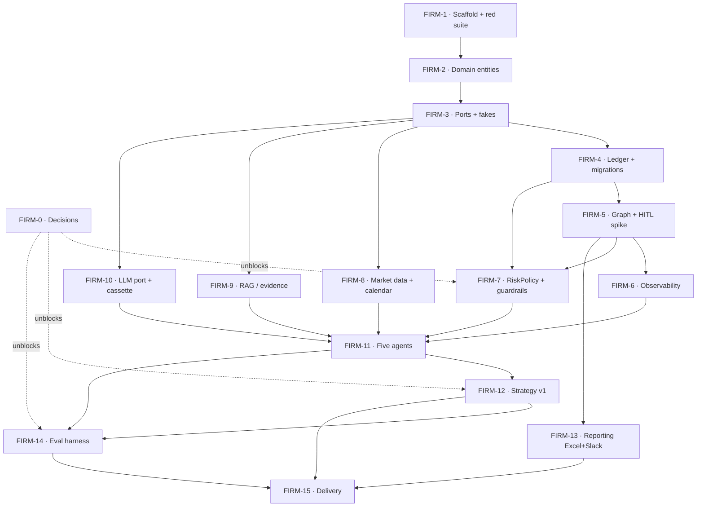

# The AI Investment Firm — Ticket Flow

> Phase 3 (task breakdown). Tickets in **dependency order**, TDD-interleaved — each feature ticket turns one or more of the ten mandatory tests from red to green. No ticket touches more than ~5 files. Critical path is bolded in the graph.

---

## Dependency graph

**Critical path:** F1 → F2 → F3 → F4 → **F5 (the spike)** → F11 → F12 → F14 → F15. Everything else hangs off it and can parallelize.

---

## Milestone 1 — Unblock & skeleton

### FIRM-0 · Make the three decisions
- **Depends:** none · **Parallel with:** FIRM-1
- **Acceptance:** RiskPolicy values, replay window, and watchlist committed to `config/` + `data/windows/`.
- **Verify:** files exist and load; values defensible in one sentence each.

### FIRM-1 · Repo scaffold + red suite
- **Depends:** none
- **Acceptance:** directory tree with a `README.md` per package, `pyproject.toml`, `Makefile`, `Dockerfile`, `docker-compose.yml`, and the **ten mandatory tests as failing stubs** (`xfail`).
- **Verify:** `make test` collects all 10, all red/xfail; `make lint` clean.
- **Closes:** (scaffolds all ten — none pass yet)

---

## Milestone 2 — Domain & persistence

### FIRM-2 · Domain entities + invariants
- **Depends:** FIRM-1
- **Acceptance:** `Portfolio`, `Holding`, `Lot`, `Trade`, `RiskPolicy` as typed models; FIFO lot math, `Portfolio.can_afford`, `Trade.revalidate(bar)`. Pure — no IO.
- **Verify:** unit tests for FIFO + affordability green; `domain/` coverage ≥ 90%.

### FIRM-3 · Port interfaces + in-memory fakes
- **Depends:** FIRM-2
- **Acceptance:** Protocols for `MarketDataSource`, `EvidenceStore`, `LLM`, `ReportSink`; in-memory fakes for tests. (Ledger is **not** a port.)
- **Verify:** a Research-agent stub runs against a fake `EvidenceStore` with no DB.

### FIRM-4 · LedgerRepository (concrete Postgres) + migrations
- **Depends:** FIRM-2, FIRM-3
- **Acceptance:** Alembic schema; atomic buy/sell (debit cash + write FIFO lot + append audit in one txn); unique idempotency key.
- **Verify:** integration tests vs ephemeral Postgres.
- **Closes:** `test_crash_mid_trade_reconciles`, `test_idempotent_execution`

---

## Milestone 3 — Orchestration spine (riskiest first)

### FIRM-5 · LangGraph skeleton + checkpointer + HITL interrupt **(the spike)**
- **Depends:** FIRM-4
- **Acceptance:** 5-node pipeline as pass-throughs; Postgres checkpointer; Risk-gate `interrupt`; resume after a `docker kill`; `expires_at` timeout → auto-reject.
- **Verify:** kill the process mid-approval → graph resumes to a committed ledger write. **Measure tokens here.**
- **Closes:** `test_hitl_resumes_after_restart`, `test_hitl_timeout_fails_safe`

### FIRM-6 · Observability
- **Depends:** FIRM-5
- **Acceptance:** OTel + Langfuse spans; `correlation_id` on every invocation/tool/trade; `make trace TRADE=<id>` reconstructs from the audit log.
- **Verify:** replay one trade end-to-end from the trace with code closed.

### FIRM-7 · RiskPolicy enforcement + guardrails
- **Depends:** FIRM-4, FIRM-5 · **Needs:** FIRM-0
- **Acceptance:** single `RiskPolicy` read by both Risk node and ledger; token circuit-breaker; output-schema validators; injection check on retrieved text; execution-time re-validation.
- **Verify:** the four guardrail tests pass.
- **Closes:** `test_limit_cannot_be_exceeded`, `test_stale_approval_revalidated`, `test_prompt_injection_neutralized`

---

## Milestone 4 — IO adapters (parallelizable)

### FIRM-8 · Market-data adapter (live + frozen) + calendar gating
- **Depends:** FIRM-3
- **Acceptance:** `MarketDataSource` live + frozen-file adapters; NYSE calendar (holidays/half-days/hours).
- **Verify:** off-hours/holiday trigger does not fill.
- **Closes:** `test_market_calendar_gating`

### FIRM-9 · RAG / EvidenceStore (pgvector)
- **Depends:** FIRM-3
- **Acceptance:** hybrid retrieve + rerank; `published_at ≤ decision_ts` filter; citations; refusal on empty/insufficient.
- **Verify:** no-lookahead + refusal tests pass.
- **Closes:** `test_no_lookahead`, `test_insufficient_evidence_refuses`

### FIRM-10 · LLM port adapter (Anthropic + cassette) + cost routing
- **Depends:** FIRM-3
- **Acceptance:** live Anthropic adapter + record/replay cassette adapter; Haiku for extraction, Sonnet for decisions.
- **Verify:** `make eval` run twice → identical (cassette replay); no network in CI.

---

## Milestone 5 — Agents & behavior

### FIRM-11 · The five agents (typed contracts)
- **Depends:** FIRM-6, FIRM-7, FIRM-8, FIRM-9, FIRM-10
- **Acceptance:** Research, PM, Risk, Execution, Reporting with Pydantic I/O + defined failure modes; wired into the graph replacing pass-throughs.
- **Verify:** each agent unit-tested against fakes; full cycle runs end-to-end.

### FIRM-12 · Strategy v1 in the PM
- **Depends:** FIRM-11 · **Needs:** FIRM-0
- **Acceptance:** momentum (tools) + news sentiment (RAG) → signal → action; sizing % capped by RiskPolicy; no LLM-emitted numbers.
- **Verify:** decisions reproducible on the frozen window.

### FIRM-13 · Reporting adapters (Excel + Slack)
- **Depends:** FIRM-5
- **Acceptance:** daily Excel report; Slack daily summary + interactive HITL approval surface.
- **Verify:** a trading day produces both artifacts; Slack approve/reject drives the graph.

---

## Milestone 6 — Eval & delivery

### FIRM-14 · Eval harness
- **Depends:** FIRM-11, FIRM-12 (uses FIRM-10 cassettes) · **Needs:** FIRM-0
- **Acceptance:** replay over the window; return vs SPY **and** process metrics (groundedness %, guardrail triggers, HITL latency, refusal rate, tokens/cost); honest report including underperformance.
- **Verify:** `make eval` reproducible; report committed.

### FIRM-15 · Delivery
- **Depends:** FIRM-12, FIRM-13, FIRM-14
- **Acceptance:** Dockerfile + compose finalized; CI runs lint+test+eval offline; Terraform deployment view; docs (README, technical overview, runbook, eval report); **one full historical day replayed and committed** with reports + traces.
- **Verify:** fresh clone → `make demo` < 10 min; `git ls-files` has no prep notes/PDFs.

---

## Notes

- **Start order:** FIRM-0 + FIRM-1 in parallel, then drive the critical path to **FIRM-5 first** — it validates the riskiest assumption (durable HITL resume) before anything is built on top of it.
- **Parallel lanes once F3 lands:** FIRM-8, FIRM-9, FIRM-10 are independent and can be built concurrently.
- **TDD:** every feature ticket starts by un-`xfail`-ing its stub and watching it fail for the right reason.
- **One commit per ticket** with a real message — the git history becomes the build narrative a reviewer reads.
